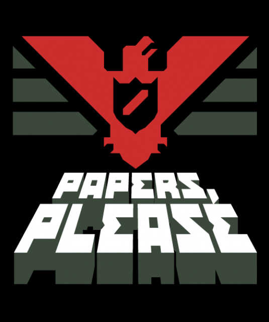

# Papers Please Game Integration Guide

## How It Works

### Architecture Overview

Your app has two parts:
1. **Static HTML pages** (homepage.html, settings.html, etc.) - Traditional web pages
2. **React Single Page Application** (index.html → main.jsx → App.jsx) - Modern React app

### Papers Please Game Integration

The Papers Please game is now fully integrated into the React app:

#### Files Location
- **Main Game Component**: `src/PapersPlease.jsx`
- **Minigames**: 
  - `src/components/minigames/MemoryMinigame.jsx`
  - `src/components/minigames/QuizMinigame.jsx`
  - `src/components/minigames/SortingMinigame.jsx`
  - `src/components/minigames/MinigameModal.jsx`

#### Route Configuration
The game is accessible at the route: **`/papers-please`**

This route is defined in `src/App.jsx` using React Router:
```jsx
<Route 
  path="/papers-please" 
  element={
    user ? (
      <SessionManager onSessionExpired={handleSessionExpired}>
        <PapersPlease onNavigateTo={navigateTo} />
      </SessionManager>
    ) : <Navigate to="/" replace />
  } 
/>
```

### How to Access the Game

#### From Static HTML (homepage.html)
```html
<a href="/papers-please">
    
</a>
```

#### From React Components (Home.jsx)
```jsx
<a href="#" onClick={(e) => { e.preventDefault(); onNavigateTo("papers-please"); }}>
    
</a>
```

## About TSX/JSX Files

### What are they?
- **JSX**: JavaScript XML - React syntax that looks like HTML in JavaScript
- **TSX**: TypeScript XML - Same as JSX but with TypeScript type checking

### How they're compiled
Your project uses **Vite** as the build tool:
1. Vite reads `index.html`
2. Loads `src/main.jsx`
3. Compiles all JSX/TSX files to regular JavaScript
4. Bundles everything together
5. Serves it to the browser

### script.js vs React Components
- **script.js**: Vanilla JavaScript for static HTML pages (homepage.html, settings.html)
  - Cannot directly use React/JSX/TSX
  - Handles DOM manipulation, dark mode, user data fetching
  
- **React Components (.jsx)**: Part of the React app
  - Compiled by Vite
  - Use React hooks, routing, state management
  - Bundle into the main app

## Current Status

✅ **Papers Please game integrated** - Converted from TypeScript to JSX
✅ **React Router configured** - Route `/papers-please` active
✅ **homepage.html linked** - Correctly points to `/papers-please`
✅ **Home.jsx linked** - Uses `onNavigateTo("papers-please")`
✅ **All minigames working** - No compilation errors

## The pp-game Folder

The `pp-game` folder contains the **original TypeScript version** of the game. It's no longer needed since we've:
1. Converted all TypeScript (.tsx) files to JSX (.jsx)
2. Integrated them into the main React app
3. Set up proper routing

**You can safely delete the pp-game folder** as all its code is now in `src/PapersPlease.jsx` and `src/components/minigames/`.

## Running the App

### Development Mode
```bash
npm run dev
```
Then visit: `http://localhost:5173`

### Production Build
```bash
npm run build
```
Output will be in the `dist` folder.

### Access the Game
1. Start dev server: `npm run dev`
2. Navigate to `http://localhost:5173`
3. Login to the app
4. Click "Papers Please" from the home screen
5. Or directly visit `http://localhost:5173/papers-please` (requires login)

## Navigation Flow

```
Static HTML (homepage.html)
    ↓ clicks "/papers-please"
React App (index.html)
    ↓ loads
React Router
    ↓ matches route
Papers Please Component
    ↓ renders
Game Interface
```

## Important Notes

1. **No TSX in script.js**: The vanilla JavaScript file cannot handle React/TypeScript. That's Vite's job.

2. **Routing is handled by React Router**: All `/papers-please`, `/home`, `/admin` routes work within the React app.

3. **Static HTML pages are separate**: homepage.html is not part of the React app - it's a standalone page that can link TO the React app.

4. **Session management**: The game requires login and uses SessionManager to track user activity.

## Troubleshooting

### Papers Please link not working?
- Make sure you're running `npm run dev`
- Check that react-router-dom is installed: `npm install react-router-dom`
- Verify the route in `src/App.jsx` is `/papers-please`

### Can't see the game?
- Make sure you're logged in first
- Check browser console for errors
- Verify all minigame files exist in `src/components/minigames/`

### Build errors?
- Run `npm install` to ensure all dependencies are installed
- Check for TypeScript errors (should be none after JSX conversion)
- Run `npm run build` to test production build
